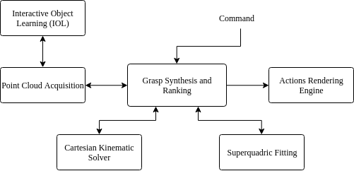

# grasp-pose-gen

Simple superquadric-based grasping pose generator and renderer for iCub 

### Dependencies
- [Yarp](https://github.com/robotology/yarp)
- [iCub](https://github.com/robotology/icub-main)
- [IOL](https://github.com/robotology/iol)
- [point-cloud-read](https://github.com/fbottarel/point-cloud-read)
- [find-superquadric](https://github.com/pattacini/find-superquadric)
- [VTK 8.1](https://www.vtk.org/)

### Installation
```
git clone https://github.com/fbottarel/grasp-pose-gen.git
cd grasp-pose-gen
mkdir build && cd build
cmake ../
make install
```

### Interaction diagram



### Usage
This module is supposed to be used to generate and execute grasps on simple objects that lie on a surface (e.g. a table) in front of the robot. Given an object to grasp, the following actions get undertaken:
1. `grasp-pose-gen` interfaces with [point-cloud-read](https://github.com/fbottarel/point-cloud-read) to retrieve a point cloud (if the object is present in the scene).
2. The point cloud is sent to [find-superquadric](https://github.com/pattacini/find-superquadric) and the parameters of the superquadric shape that best fits the point cloud are obtained. 
3. A number of feasible side and top grasps are generated and displayed according to the size and position of the resulting superquadric. The module makes sure that none of the poses are unreachable by the robot. 
4. The candidate grasps are ranked according to a hierarchical cost function that takes into account, in order
    1. The kinematic accuracy that the position can be reached with (**primary cost**)
    2. The orientation accuracy and the way the superquadric is being grasped (this **secondary cost** guides the algorithm toward grabbing the short sides of the superquadric)
5. The best grasp is selected and its offset gets corrected by going through a [iolReachingCalibration](http://robotology.github.io/iol/doxygen/doc/html/group__iolReachingCalibration.html) RPC.
6. If requested, the grasp gets executed with the desired hand.

The module visualizes the point cloud, superquadric, and suitable grasps. The best grasp is highlighted by a larger indicator, and for each grasp the cost function is displayed in the format `[primary_cost]_[secondary_cost]`.

Once all the modules are running and connected (the code comes with a `yarpmanager` app to keep track of the connections) it can be interacted via RPC calls to `/graspProcessor/cmd:rpc`. The available commands are as follows:

- `grasp_pose objectToGrasp hand` triggers the synthesis of a suitable grasp _without_ executing it. The grasp gets displayed on the visualizer.
- `from_off_file pointCloudFile hand` same as previous command, but the point cloud gets parsed from a `.off` (examples are provided with the code) and therefore there is no call to `point-cloud-read`. 
- `grasp objectToGrasp hand` generates a good grasp position/pose and executes it with the requested hand.
- `home` relays a homing command to IOL, moving the robot in the ready state.
- `drop` the robot gently drops the object in front of him. 

All of these commands (at the moment) return an `ack` if the module reaches the end of the procedure, otherwise `nack`

### Command-line parameters
- `--name moduleName`: start the module with the desired name (watch out for the port names!). 
- `--sim`: if you need to use the module with the iCub-SIM.
- `--control-arms [both|left|right]`: let you specify which arm to control exclusively.

### Example
```
yarp rpc /graspProcessor/rpc
>>grasp_pose Box right
Response: [ack]
```

